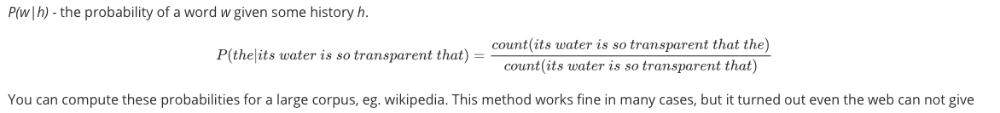
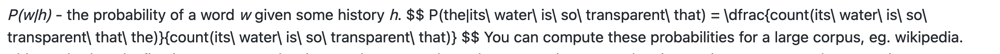

## My learning notes

This repository has the following purposes:

- a notebook - for quicker understanding of what I read
- a summary - to quickly go back to what I read
- a log - for the record when and what I read
- a contract - to be systematic in reading

Notes in this repo are focused mostly on Python, Machine Learning and Architecture.

### Books

[Hands-On Machine Learning with Scikit-Learn, Keras, and TensorFlow: Concepts, Tools, and Techniques to Build Intelligent Systems](books/hands-on-ml.md)

[Clean Code: A Handbook of Agile Software Craftsmanship](books/clean-code.md)

[Code Complete: A Practical Handbook of Software Construction](books/code-complete.md)

[Designing Data-Intensive Applications: The Big Ideas Behind Reliable, Scalable, and Maintainable Systems](books/designing-data-intensive-applications.md)

[Speech and Language Processing: An Introduction to Natural Language Processing, Computational Linguistics and Speech Recognition](books/speech-and-language-processing.md)

### Courses
[Course @ FastAI](courses/fast-ai.md)

### Conferences

[AWS Innovate: AI/ML Edition 2021](conferences/aws-innovate-ai-ml-21.md)

### Patterns

[Architecture](patterns/architecture.md)

[Code](patterns/code.md)

[Messaging](patterns/messaging.md)

### Teaching

> *The best way to learn is to teach* ~ Frank Oppenheimer 

Hence this *subsection* is a part of `learning` repository :slightly_smiling_face:

[Introduction to Programming: Python for beginners](teaching/python-intro/README.md)

[Python Intermediate](teaching/python-intermediate/README.md)

--

### Typora

I use **Typora** to write the notes. If you really need to read my notes, I strongly encourage you to open them in Typora because of much better formatting:

###### Typora:

###### GitHub in the browser...:

Typora is truly superior :slightly_smiling_face:

