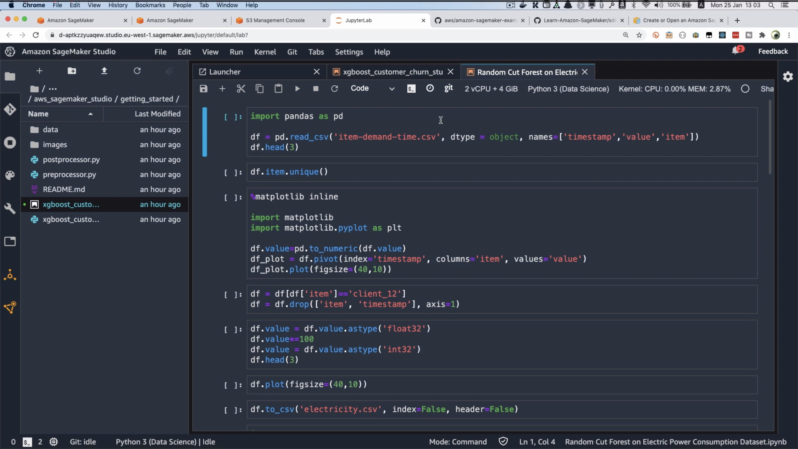
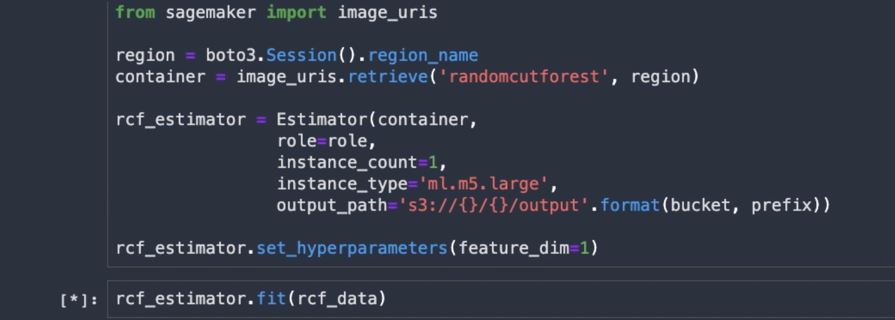
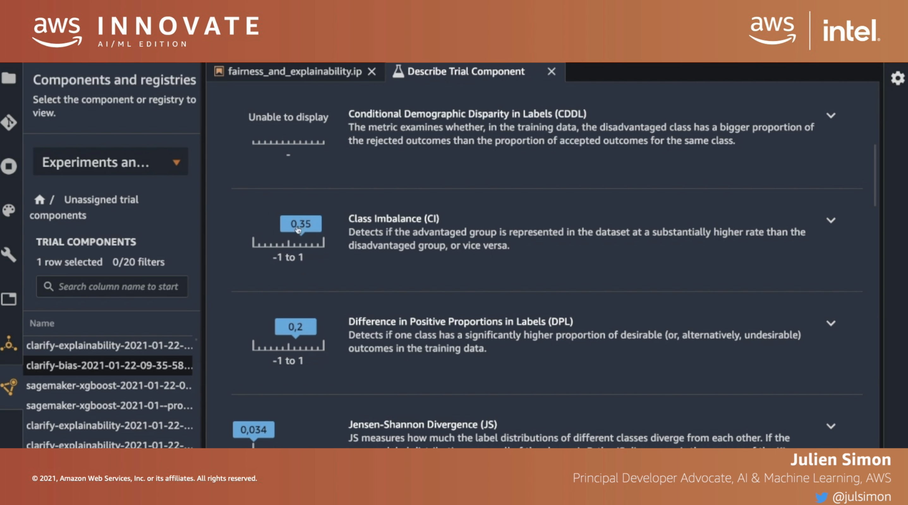
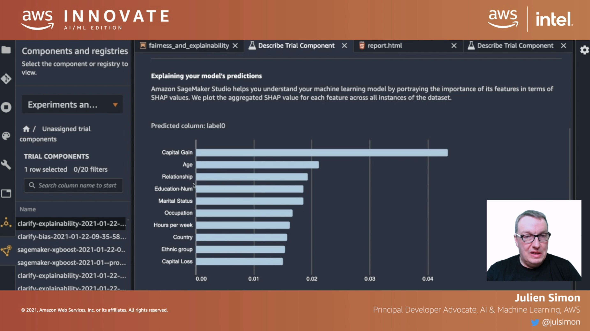
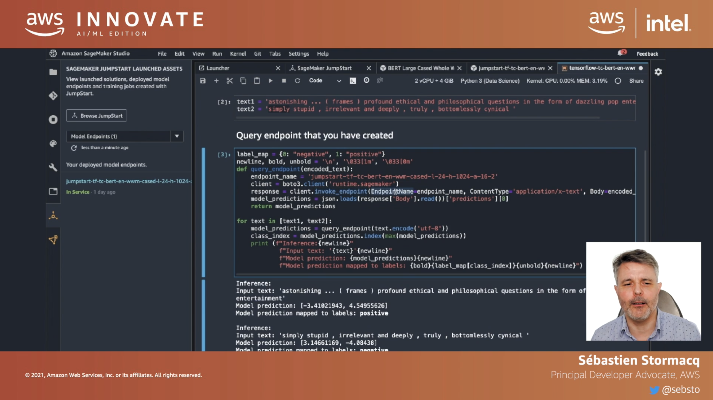

[go back](https://github.com/pkardas/learning)

# AWS Innovate: AI/ML Edition 2021

- [Move and scale your ML experiments in the cloud](#move-and-scale-your-ml-experiments-in-the-cloud)
- [Detect potential bias in your datasets and explain how your models predict](#detect-potential-bias-in-your-datasets-and-explain-how-your-models-predict)
- [Deploy state-of-the-art ML models and solutions in a single click](#deploy-state-of-the-art-ml-models-and-solutions-in-a-single-click)

Online conference took part on 24.02.2021, I participated in a couple of talks.

## Move and scale your ML experiments in the cloud

Machine learning experiments (labeling the data, storage, sharing, saving, tuning parameters) can be done in Amazon
SageMaker IDE - secure, scalable, compliant solution - DevOps ready solution.

**How to start?** We usually start with local notebooks, which are not powerful enough. You could move your Jupiter
Notebook to the cloud (doing it on your own - a lot of maintenance), we can do better.

DEMO:

1. Just go to the SageMaker page on AWS
2. Open SageMaker Studio (limitation: one instance per region)
3. We are going through Standard setup:
    1. Authentication method selection (SSO or IAM)
    2. Permissions: which resources it can access - eg. storage, by default SageMaker has access to any bucket with "
       sagemaker" in the name
    3. You can make your notebook shareable
    4. Network and storage definitions - VPC or Public Internet, security groups, encryption
    5. You can add your tags to identify resources
4. Setup will take a few minutes

You can open the application. This is literally JupyterLab. You can copy for example GitHub repo there and run the
notebooks (it has git integration, so switching between branches is easy). You can easily switch machines, largest:
488GB of RAM!

Example training:

SageMaker is not just a notebook - it allows for data preparation, building models, training, tuning and deployment.

## Detect potential bias in your datasets and explain how your models predict

Bias - unfair representation of reality, as we use datasets, there is a risk, that data we use does not represent
reality.

Explainability - complex models, hard to understand why model came up with a prediction (eg. deep learning). We need to
know why model came up with certain decision, eg. medicine, legal obligations.

**How to solve these issues?**

We used some dataset that have following columns: age, sex, skin colour, ... Zooming in on sex: 1/3 female, 2/3 males -
imbalanced. Zoom even more, 1:7 for sex earnings with >50k USD. Model can be biased towards overrepresented group.

So the first approach is to visualise the data to detect bias. But AWS has something better.

**Analysis using Amazon SageMaker Clarify**

Bias analysis: pre-training analysis and post-training analysis. We define "potential" biased group: `faced_name="Sex"`.
Results are displayed in a nice charts (many awesome metrics):

It also outputs report in HTML and Jupyter Notebook.

**Explainability** - it uses SHAP 🎉 https://github.com/slundberg/shap

For explainability AWS outputs similar report:

## Deploy state-of-the-art ML models and solutions in a single click

SageMaker Studio. Problem: text analysis, there are 60 models prepared for text analysis. We can select one, eg. trained
on Wikipedia. Then we can deploy the model, we can fine tune the model - we need to provide the dataset in a special
format. Model has an endpoint, which can be tested in the Jupyter Notebook.

We have a notebook, but we can not give it to the Product Managers, that is why we can integrate it with for example an
UI. There are libraries for the integration with JavaScript. Example: banana slicer review from Amazon:

New data flow - tool for preparing a new data. Then you can pass the data to the model to train.

**Remember to shut down the endpoint because you pay for it $$$.**
