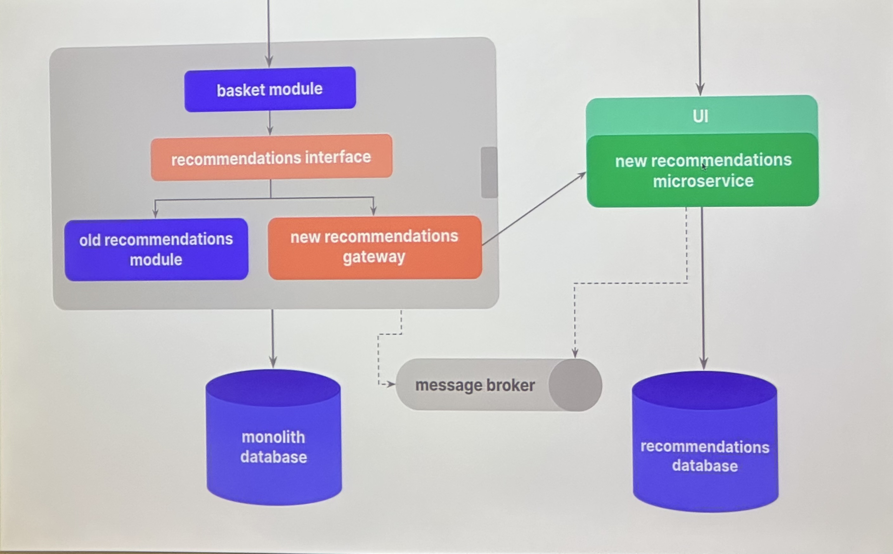
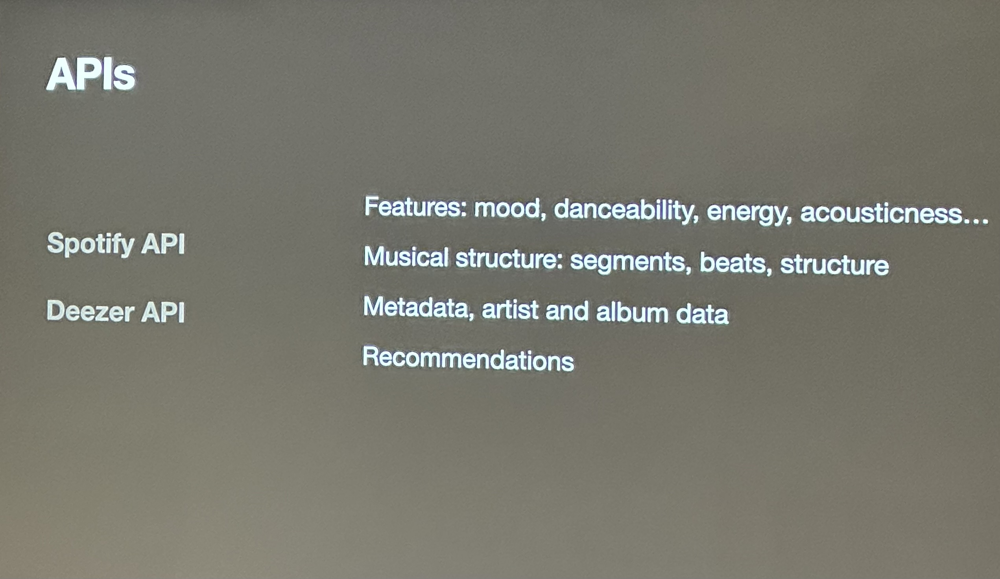
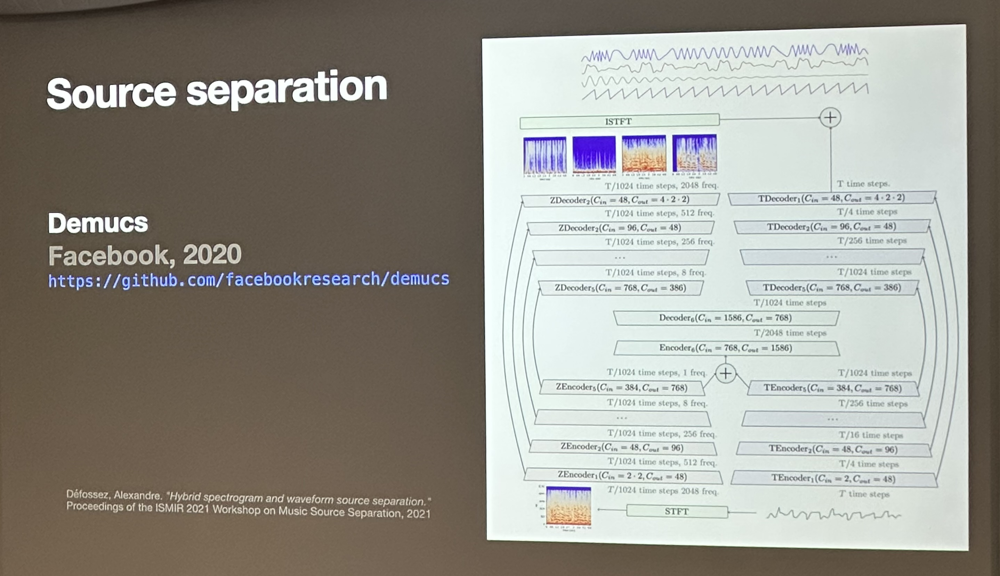
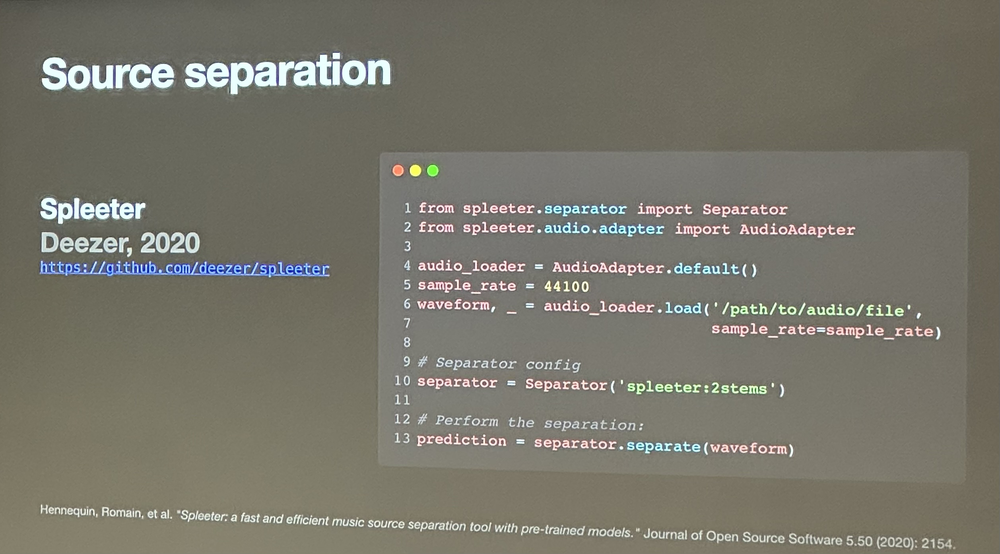
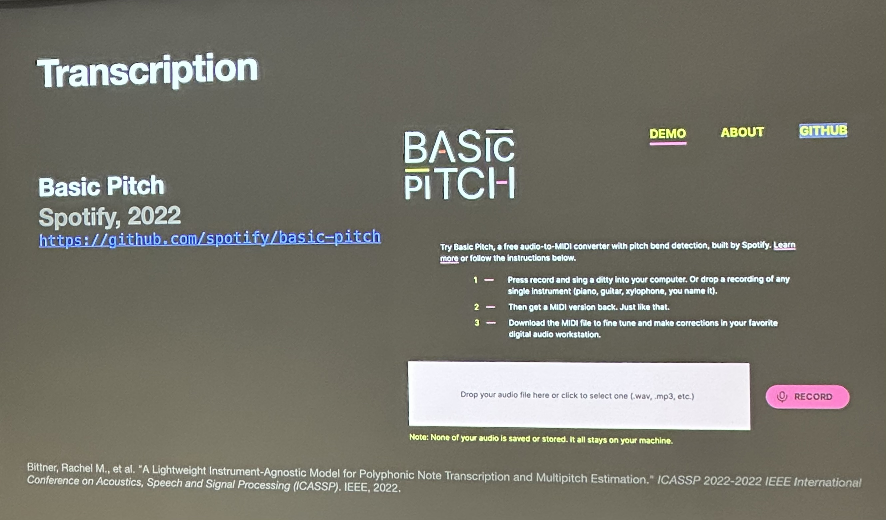
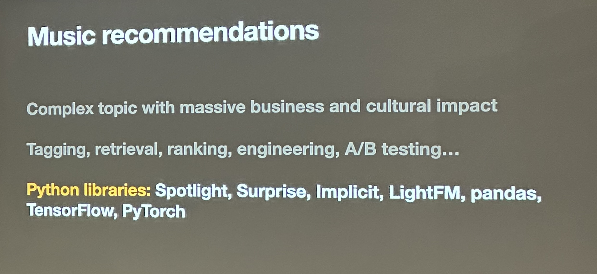

[go back](https://github.com/pkardas/learning)

- [[EN] Don’t use a lot where a little will do. A story of programming tricks you wish you invented](#en-dont-use-a-lot-where-a-little-will-do-a-story-of-programming-tricks-you-wish-you-invented)
- [[EN] Effective data science teams with databooks](#en-effective-data-science-teams-with-databooks)
- [[PL] Poetry - poezja pythonowych pakietów](#pl-poetry---poezja-pythonowych-pakietw)
- [[EN] Interfaces in Python. The benefits and harms](#en-interfaces-in-python-the-benefits-and-harms)
- [[EN] Observability in backends with Python and OpenTelemetry](#en-observability-in-backends-with-python-and-opentelemetry)
- [[EN] Hitchhiker's guide to typing](#en-hitchhikers-guide-to-typing)
- [[EN] Lightning talks](#en-lightning-talks)
- [[PL] Dzielenie monolitu w praktyce](#pl-dzielenie-monolitu-w-praktyce)
- [[EN] pytest on steroids](#en-pytest-on-steroids)
- [[EN] Music information retrieval with Python](#en-music-information-retrieval-with-python)

## [EN] Don’t use a lot where a little will do. A story of programming tricks you wish you invented

Regex has a debug mode - `re.DEBUG`

Python has a built-in HTTP server capable of serving static files from the current directory.

## [EN] Effective data science teams with databooks

`databooks` - a tool for dealing with notebooks (automatic conflict resolution, metadata stripping, pre-commit hooks,
printing a notebook in a terminal, pretty printing git diff)

Architecture as Code (AaC) with Python or way to become your own boss

Prototyping and visualization of system architecture using code.

`diagrams` - a library for creating diagrams from Python

## [PL] Poetry - poezja pythonowych pakietów

Narzędzie do zarządzania zależnościami, a także do tworzenia pakietów oraz ich publikacji.

Może zastąpić `pip` czy `virtualenva`.

Wersjonowanie semantyczne: `major.minor.patch`

## [EN] Interfaces in Python. The benefits and harms

Abstract classes in Python - ABC

Sequence - any collection implementing 2 methods (length and getter)

Dependency Injection - passing parameters directly to for example init method.

## [EN] Observability in backends with Python and OpenTelemetry

Trace - a JSON object, can travel between services. Simple types (int, bool, lists, ...)

Auto-instrumentation - install a couple of libraries, run the command, done.

Manual-instrumentation - via a context manager or a decorator inside the code.

Distributed tracing with queues - context of the trace is going to be part of the massage that you enqueue.

Jagger - one of tools compatible with OpenTelemetry.

unicorn has a separate thread for OpenTelemetry data.

## [EN] Hitchhiker's guide to typing

urllib3 case study: https://sethmlarson.dev/blog/tests-arent-enough-case-study-after-adding-types-to-urllib3

## [EN] Lightning talks

GitHub Actions are capable of running cron jobs.

Idea: when learning a new language, rewrite an existing command line tool in selected language.

## [PL] Dzielenie monolitu w praktyce

Kryteria sukcesu wydzielania mikroserwisu: chce szybko widzieć efekty, moc wycofać się w każdym momencie, testować
system z ruchem produkcyjnym, ALE nie chce zepsuć produkcji, chce moc wrócić do starego rozwiązania, jak najmniej
zmieniać w monolicie.

Przekształcanie monolitu w mikroserwisu: wydzielenie interfejsu w monolicie, stworzenie mikroserwisu z identycznym
interfejsem, dodanie nowej implementacji w monolicie korzystającej z nowego serwisu. Gdy przychodzi zapytanie możemy je
wysyłać do dwóch miejsc, ostateczna odpowiedź powinna pochodzić ze starego systemu, po okresie testów przełączamy się na
nowe rozwiązanie.

Strangler Pattern - nazwa pochodzi od rośliny, która pasożytuje na drzewie, wykorzystuje je żeby rosnąć w górę po czym
je zabija.

Działanie w Shadow Mode - wydzielenie mikroserwisu, zebranie zapytań i wyników.

## [EN] pytest on steroids

Everything in pytest is a plugin. When you create a fixture you create a local plugin.

## [EN] Music information retrieval with Python

`pedalbord` by Spotify - a python library for audio effects

`Pyo` - audio synthesis engine, effects control, implementing loopers, used in live music

`ISMIR dataset` - various datasets with music, lyrics, ...

`mirdata` - a Python wrapper for ISMIR datasets

`Librosa` - a library for music analysis

In general, there are plenty tools for music analysis, which then can be used to train ML models.

Music recommendations: very complex, massive business and cultural impact:

Generating music - neural audio synthesis or symbolic composition (then needs to be played by a human).

Links:
- https://openai.com/blog/jukebox/
- https://youtu.be/bXBliLjImio
- https://youtu.be/MwtVkPKx3RA
- https://youtu.be/tgq1YTQ2c0s
- https://magenta.tensorflow.org
