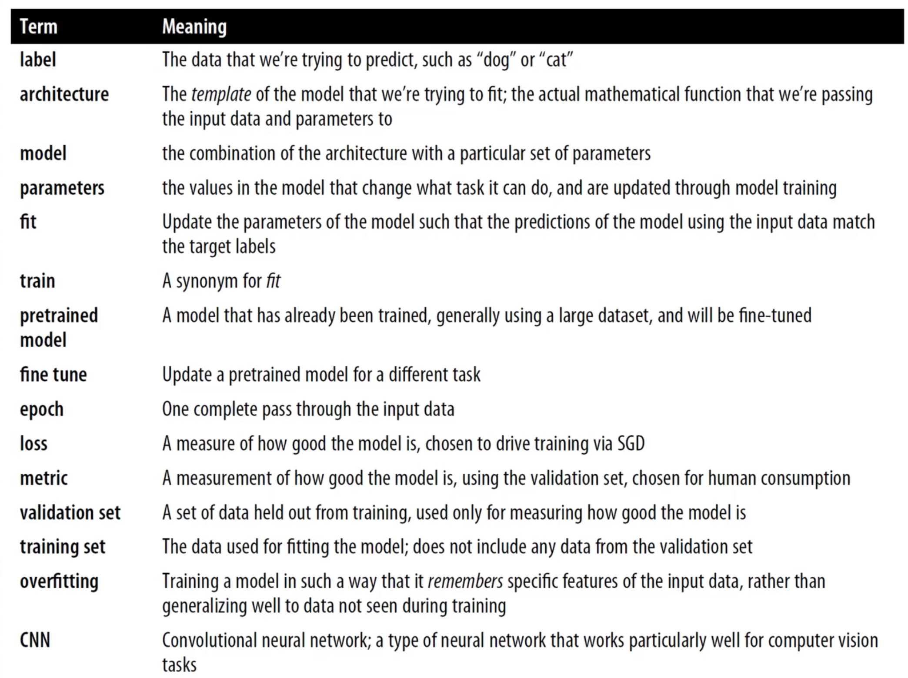

[go back](https://github.com/pkardas/learning)

# Practical Deep Learning for Coders

Course -> https://course.fast.ai/

[TOC]

## Lesson 1

Truth, to start with Deep Learning:

- high school math is sufficient
- there is no need for enormous amounts of data
- no need for expensive hardware for basic usage

1961 first machine built on top of mathematical model from 1943. Heavily criticised by Minsky - example that artificial
neural network could not learn simple XOR. Global academic gave up on neural networks.

1986 MIT released a paper defining requirements for building and using neural networks. Later researchers proved, that
adding additional layers of neural networks is enough to approximate any mathematical model. But in fact these models
were too slow and too big to be useful.

**What is ML?** Like regular programming, a way to get computers to complete a specific task. Instead of telling the
computer the exact steps to solve a problem, show it examples fo the problem to solve and let it figure out how to solve
it itself.

*Neural network* - parametrised function that can solve any problem to any level of accuracy (in theory - *universal
approximation theorem)*.

What does it mean to train neural network? It means finding good weights. This is called **SDG**. SDG - Stochastic
Gradient Descent.

Neural Networks work using patterns, need labeled data and create PREDICTIONS not recommended actions.

You need to be super careful what is the input data (initial bias, stereotypic data) will produce biased results. E.g.
marihuana consumption is equal amon whites and blacks, but black people are mor often arrested for marijuana possession.
Given biased input data will produce biased predictions, e.g. send more police officers to black neighbourhoods.

Segmentation - marking areas on images (trees, cars, ...)

## Lesson 2

When you want to predict a category you are facing a classification problem. Whenever you want to predict a number you
are dealing with regression problem.

```python
learn = cnn_learner(data, architecture, metric)
```

Architecture - e.g. *resnet32, resnet64* - name of the architecture (64 layers) - function that we are optimising.

Epoch - e.g. looking at every image in the training set = 1 epoch, 1 loop

Metric - function measuring quality of the model's predictions (*error_rate, accuracy*), we care about it.

Loss != Metric, loss - computer uses this to update parameters, computer cares about it. For example tweaking parameters
just a little might not change accuracy or error rate.

Model might cheat - "I have seen this image, this is a cat", we don't want model to memorise images. That is why we need
splitting into training and validation. For validating time-series, you should not removed e.g. 20% of the data, instead,
drop off the end and let the model predict e.g. next 2 weeks.

*Transfer learning* - using a pretrained model for a task different to what it was originally trained for. Take
pretrained (initial weights), add more epochs on your specific dataset and you will end up with way more better model.

*Fine tuning* - transfer learning technique where the weights of pretrained model are updated by training for additional
epochs using different task to that used for pretraining.

You can take advantage of pretrained feature - e.g. dog faces, patterns, etc.

Computer Vision can be used for variety of problems, e.g. sound, virus analysis (data transformed into images).



Set of pretrained models: https://modelzoo.co/

*How to decide if there is a relationship?*

*Null hypothesis* - e.g. "no relationship between X and Y" -> gather data -> how often do we see a relationship?

*P-Value* - probability of an observed result assuming that the null hypothesis is true.

## Lesson 3

Square images are easier to process, you need to remember the length of only one dimension. `Squishing` is the most
efficient method for resizing, because cropping removes information, adding black bars wastes computations. Another most
common method is `Random Resize Crop` - few batches, different parts of the image are taken

ImageClassifierCleaner - utility tool (GUI) for finding examples, classifier is least confident about. You can manually
improve labelling.

`VBox` - you can group multiple widgets together and create prototype application in notebook.

`viola` - plugin for hiding cells with code, only inputs and outputs are visible. Add `viola` to the URL, and it will
display an application-like website in the browser. Great for prototyping.

mybinder.org - you can turn notebook from GitHub into a publicly available web application.

*Healthy skin* example - bing returns images of a young white woman - bias!

Book recommendation: *Building Machine Learning Powered Applications*

Feedback loop - e.g. predictive policing - system that sends police - feedback loops can result in negative implications
of that bias getting worse and worse - e.g. you send police to the same place over and over.

FastPages - dump notebook into a page.

Recognising hand written digits (MNIST) was considered challenging problem ~20 years ago. Baseline idea: compare model /
ideal number with input - for MNIST, calculate average of the training set, on validation set - calculate distance (~95%
accuracy). Baseline should be something simple to implement - then you build something on top of it.

Broadcasting - if shapes of 2 elements don't match, e.g. A (1010, 28, 28) - B (28, 28), B will be subtracted from every
1010 items from A.

PyTorch has engine for calculating derivatives. In PyTorch `_`  at the end of the method means "method in place".

Learning rate - size of a step in gradient descent

## Plant Pathology

https://www.kaggle.com/c/plant-pathology-2021-fgvc8/overview

```python
import csv
from fastai.vision.all import *
from fastai.metrics import error_rate,
    accuracy

path = Path("/kaggle/input/plant-pathology-2021-fgvc8")

# Prepare data, labels are stored separately:
with open(path / "train.csv", mode='r') as csv_file:
    csv_reader = csv.DictReader(csv_file)

    train_labels = {
        row["image"]: row["labels"]
        for row in csv_reader
    }


# Function used for labeling images:
def label_func(file_path: Path) -> str:
    return train_labels[str(file_path).split('/')[-1]]


# Read data:
data_block = DataBlock(
    blocks=(ImageBlock, CategoryBlock),
    get_items=get_image_files,
    get_y=label_func,
    item_tfms=Resize(224)
)

# DataBlock to DataLoader:
data_loaders = data_block.dataloaders(path / "train_images")

# Available classes:
data_loaders.vocab

# Few example images:
data_loaders.show_batch()

# ResNet34 architecture for image classification:
learner = cnn_learner(data_loaders, models.resnet34, metrics=error_rate)

# 4 epochs, unfortunately one epoch takes ~1h most probably because of incorrect use of 'item_tfms' in DataBlock, which disables GPU usage:
learner.fine_tune(4)

# Model validation, this model achieved 0.62 error_rate. 
interpretation = ClassificationInterpretation.from_learner(learner)
interpretation.plot_confusion_matrix()
interpretation.plot_top_losses(5, nrows=1, figsize=(25, 5))

# Saving model:
learner.export()
```

