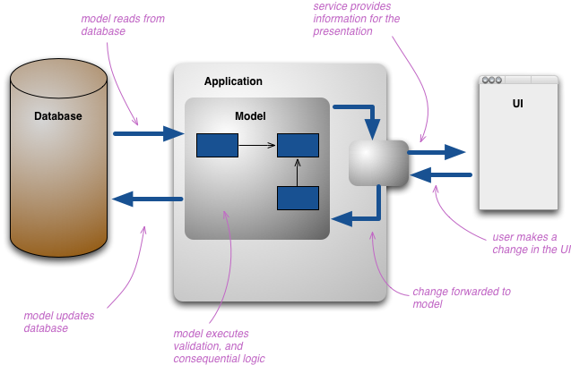

[go back](https://github.com/pkardas/learning)

# Architecture Patterns

- [Command and Query Responsibility Segregation (CQRS)](#command-and-query-responsibility-segregation-cqrs)
- [Reporting Database](#reporting-database)
- [Event Sourcing](#event-sourcing)
- [Saga](#saga)

## Command and Query Responsibility Segregation (CQRS)

Based on: https://docs.microsoft.com/en-us/azure/architecture/patterns/cqrs, https://martinfowler.com/bliki/CQRS.html
, https://bulldogjob.pl/articles/122-cqrs-i-event-sourcing-czyli-latwa-droga-do-skalowalnosci-naszych-systemow_

This pattern separates read and update operations for a data store. Traditionally the same data model is used to query
and update a database. This might work well but for simple CRUD applications. For more complex applications, where there
are more advanced operations on read and write sides CQRS might be a better idea.

Commands update data, queries read data. Commands should be *task based*, rather than *data centric* (book hotel room
instead of set `reservation_status` to `reserved`). Queries *never* modify the database.

Usually whenever command updates data it is also publishing an event and this needs to be done within a single
transaction.

CQRS:

- you are able to scale Command and Query independently
- separate models for updating and querying might lead to eventual consistency
- suited for complex domains

## Reporting Database

Based on: https://martinfowler.com/bliki/ReportingDatabase.html

Set up second database for reporting purposes, this database is completely different from the operational (application)
database.

Reporting Database:

- designed specifically for reports

- can be denormalized, usually read-only - redundant information might speed up queries
- queries on the database don't add to the load on the operational database
- additional data might be derived from the operational database
- needs to be synced somehow with the main database (eg. sync data overnight or sync using events)

## Event Sourcing

Based on: https://docs.microsoft.com/en-us/azure/architecture/patterns/event-sourcing
, https://microservices.io/patterns/data/event-sourcing.html

> How to reliably/atomically update the database and publish messages/events?

Instead of maintaining current state, application can have a log of state changes. Whenever the state of a business
entity changes, a new event is appended to the list of events. Since saving an event is a single operation, it is
inherently atomic. The application reconstructs an entity’s current state by replaying the events.

The event log also behaves like message broker. When a service saves an event in the event store, it is delivered to all
interested subscribers.

> Event sourcing is commonly combined with the CQRS pattern by performing the data management tasks in response to the
> events, and by materialising views from the stored events.

In order to maintain consistency in multi-threaded applications, adding a timestamp to every event might help in
resolving issues, but not in all cases. Better approach is to label each event with an incremental identifier. If two
actions attempt to add events for the same entity at the same time, the event store can reject an event that matches an
existing entity identifier.

This pattern is useful when:

- you want to capture intent, purpose, or reason in the data
- you want to record events that occur, and be able to replay them to restore the state of a system, roll back changes,
  or keep a history and audit log

Not useful when:

- small problems
- consistency and real-time updates to the views of the data are required
- history, and capabilities to roll back and replay actions are not required

Example: banking system - list of all transactions, basing on these transactions your total balance is calculated.

## Saga

Based on: https://microservices.io/patterns/data/saga.html

In a design where each service has its own database, sometimes transactions have to span multiple services, hence local
ACID transaction is not an option.

A solution to this problem is *Saga* - a sequence of local transactions. Each local transaction updates the database and
publishes a message or event to trigger the next local transaction in the saga. If a local transaction fails because it
violates a business rule then the saga executes a series of compensating transactions that undo the changes that were
made by the preceding local transactions.

For example: Service A creates a new Order with PENDING state and publishes an event that is consumed by another service
B, service B responds with an event to service A. Service A accepts or rejects new Order.

DON'T: Based on `Chapter 17: Microservices Architecture` @ `Fundamentals of Software Architecture`:

> Don't do transactions in microservices - fix granularity instead.
